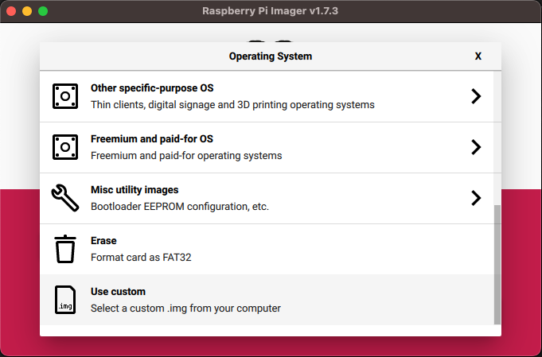

# Waggle RPi SD Flash

Creates a compressed RPi SD card image file that is flashed during the manufacturing process of the [Waggle nodes](https://github.com/waggle-sensor/node-platforms). This image configures the RPi for PxE booting the [Waggle RPi PxE Boot OS](https://github.com/waggle-sensor/waggle-rpi-pxeboot)

The instructions below demonstrate how to [use the build pipeline to produce the compressed SD image file](#usage-how-to-build-the-sd-card-image-file) in addition the [technical details to how to make updates to use a different bootloader firmware version](#technical-details).

The following reference documentation may be useful for understanding the details of this build pipeline:
- [Rasbperry Pi 4 Boot EEPROM Documentation](https://www.raspberrypi.com/documentation/computers/raspberry-pi.html#raspberry-pi-4-boot-eeprom)
- [Firmware Boot Configuration](https://www.raspberrypi.com/documentation/computers/raspberry-pi.html#configuration-properties)
- [Firmware EEPROM File Details](https://www.raspberrypi.com/documentation/computers/raspberry-pi.html#eeprom-update-files)

## Usage (how to build the SD card image file)

To build the compressed SD card image file simply run the following:

```
./build.sh
```

This will produce a versioned image file (ex. `waggle-rpi-sdflash_1.2.0-gbe33a45.img.xz`) that can be directly flashed to the SD card (using the [Raspberry Pi Flashing Tool](https://www.raspberrypi.com/software/))



Then the SD card image can be inserted into a RPi and the RPi powered on.  During first boot the system will be auto-configured to net PxE boot.

## Technical Details

> You can read these technical details if you are interested in how the build pipeline works or if you need to make a change. Otherwise, just following the ['Usage' instructions](#usage-how-to-build-the-sd-card-image-file) above and flashing the resulting image file should be sufficient.

During the build process the target base RPi image file (latest [`buster`](https://www.debian.org/releases/buster/) to enable non-interactive first boot) is downloaded into the Docker image. Then the `release.sh` script mounts the image `boot` and `root` partitions to enable customization. At this point the contents of the `ROOTFS` folder is copied to the `root` partition and the `BOOTFS` folder to the `boot` partition.

The `apply-waggle-bootfw.sh` script is executed in a [`chroot`'d](https://man7.org/linux/man-pages/man2/chroot.2.html) environment on the image `root` partition. This script then uses the `rpi-eeprom` tools to create the Waggle customized (from the `bootconf.txt` file) EEPROM update files which are based on the target RPi EEPROM base file.  These customized EEPROM files (`pieeprom.upd` and `pieeprom.sig`) are then copied to the images `boot` partition.

The image is unmounted, compressed, and then exported to the `output` directory.

On first boot of the SD card containing the produced image the RPi EEPROM identifies the presence of the `pieeprom.upd` file (and related `.sig` and `recovery.bin` files) and automatically performs the EEPROM update to the Waggle customized EEPROM, enabling net PxE boot.

## Making Updates to Boot Configuration

Specific versions of the RPi base image, `rpi-eeprom` tool and FW, and base `default` bootloader firmware are specified throughout the code pipeline on purpose.  **We do NOT want to specify "latest" to ensure comppatibility.** With that said, the below outlines some details on how to update some of the specifics regarding the bootloader configuration.

> **IMPORTANT: changes to the EEPROM version may have dependency on the NFS mounted bootloader files specified by the [Waggle RPi PxE Boot OS](https://github.com/waggle-sensor/waggle-rpi-pxeboot) repository. So, take caution before changing the base EEPROM version.**

> RPi base image is specified in the `Dockerfile`

> `rpi-eeprom` and base `default` bootloader firmware are defined in the `apply-waggle-bootfw.sh` script

To launch an "interactive" Docker instance that enables inspection of the base RPi image file you can use the following steps

1. Execute `./boot.sh -a`

    This will pause the build pipeline right after the image `boot` and `root` partitions are mounted.
    ```
    # ./build.sh -a
    == Mount RPI Filesystem
    add map loop3p1 (253:6): 0 524288 linear 7:3 8192
    add map loop3p2 (253:7): 0 3170304 linear 7:3 532480
    Build is paused. Image mounted @ bootmnt & rootmnt. Press enter to continue...
    ```

2. In another terminal, execute a `docker exec` command to get `bash` shell instance into the paused container from the above step

    ```
    $ docker exec -it $(docker ps -f "ancestor=pi_sdflash" -q) /bin/bash
    root@f64eb2f36ba4:/# ls /bootmnt/ /rootmnt/
    /bootmnt/:
    COPYING.linux           bcm2710-rpi-2-b.dtb       bootcode.bin  fixup_db.dat  start4.elf
    LICENCE.broadcom        bcm2710-rpi-3-b-plus.dtb  cmdline.txt   fixup_x.dat   start4cd.elf
    bcm2708-rpi-b-plus.dtb  bcm2710-rpi-3-b.dtb       config.txt    issue.txt     start4db.elf
    bcm2708-rpi-b-rev1.dtb  bcm2710-rpi-cm3.dtb       fixup.dat     kernel.img    start4x.elf
    bcm2708-rpi-b.dtb       bcm2710-rpi-zero-2-w.dtb  fixup4.dat    kernel7.img   start_cd.elf
    bcm2708-rpi-cm.dtb      bcm2710-rpi-zero-2.dtb    fixup4cd.dat  kernel7l.img  start_db.elf
    bcm2708-rpi-zero-w.dtb  bcm2711-rpi-4-b.dtb       fixup4db.dat  kernel8.img   start_x.elf
    bcm2708-rpi-zero.dtb    bcm2711-rpi-400.dtb       fixup4x.dat   overlays
    bcm2709-rpi-2-b.dtb     bcm2711-rpi-cm4.dtb       fixup_cd.dat  start.elf

    /rootmnt/:
    bin   dev  home  lost+found  mnt  proc  run   srv  tmp  var
    boot  etc  lib   media       opt  root  sbin  sys  usr
    ```

    From here you can inspect and perform actions on the `boot` (`/bootmnt`) and `root` (`/rootmnt`) partitions. Reference the `./release.sh` script for details. For example the possible base EEPROM files in the base image (before updating `rpi-eeprom`) are stored in `ls /rootmnt/usr/lib/firmware/raspberrypi/bootloader/`

3. When you are done you should exit the `docker exec` instance (to ensure the mounted partitions are not in use) and then press `ctrl-c` within the "paused" build pipeline.  This will unmount the image partitions and exit the paused build pipeline.

    > It is **important** to release the mounts as they use [loop devices](https://www.man7.org/linux/man-pages/man8/losetup.8.html) on your host machine.

### BOOTFS `cmdline.txt`

The `cmdline.txt` file outlines the kernel command line options when booting from the backup SD card image.  See the [waggle-rpi-pxeboot](https://github.com/waggle-sensor/waggle-rpi-pxeboot/tree/main/ROOTFS/media/rpi/sage-utils/dhcp-pxe/tftp) repository for the details on the kernel `cmdline.txt` file that is used during normal PxE boot.

The `cmdline.txt` file that is here is based on the base RPI `buster` image used to make the customized SD card flash image. You can follow the above instructions to inspect the base images `/bootmnt/cmdline.txt` file.

### ROOTFS `bootconf.txt`

The `bootconf.txt` file specifies the EEPROM boot options and is what instructs the EEPROM to attempt a net PxE boot as it's priority boot option.  The `bootconf.txt` file doesn't do anything itself, but must be combined with a EEPROM file using the `rpi-eeprom` tools.

You can reference the `apply-waggle-bootfw.sh` script for how this is used to create the Waggle specific EEPROM files.

### Updated to a new EEPROM version

> **The base EEPROM version should ONLY be changed if new features or hardware support is required.**  There is a dependency with the NFS mounted bootloader files specified by the [Waggle RPi PxE Boot OS](https://github.com/waggle-sensor/waggle-rpi-pxeboot). Any changes in the version here may require a corresponding change to the [Waggle RPi PxE Boot OS](https://github.com/waggle-sensor/waggle-rpi-pxeboot)

The version of the base EEPROM is specified by the `apply-waggle-bootfw.sh` script and you can reference the [RPi Bootloader Release Folder Documentation](https://www.raspberrypi.com/documentation/computers/raspberry-pi.html#bootloader-release) for an explanation of the different release channels. The `default` release channel should be used as it contains the most stable and trusted EEPROM releases.

In order to get access to newer EEPROM releases you will need a newer version of the `rpi-eeprom` tool, which is also specified by the `apply-waggle-bootfw.sh` script.
